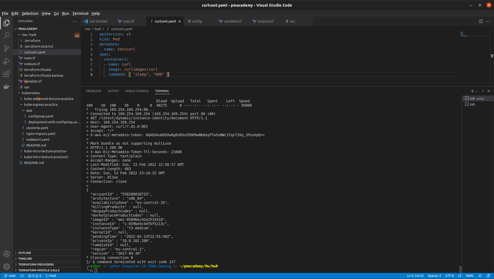

# HW8_kube_tf
In this task i used a local tf state
## Short instruction
```bash
terraform init
terraform plan
terraform apply
kubectl apply -f curcont.yaml
kubectl exec -it testcurl -- sh
$ TOKEN=curl -X PUT "http://169.254.169.254/latest/api/token" -H "X-aws-ec2-metadata-token-ttl-seconds: 21600" \
&& curl -H "X-aws-ec2-metadata-token: $TOKEN" -v http://169.254.169.254/latest/dynamic/instance-identity/document
```
## Screenshot of idenitity doc


